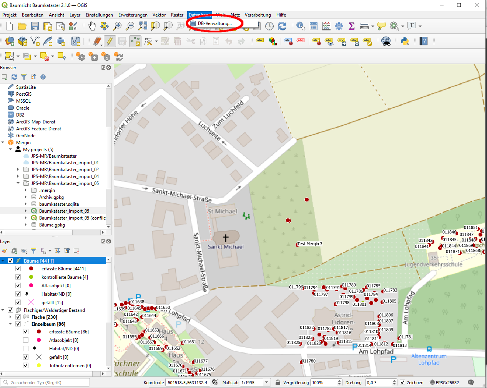
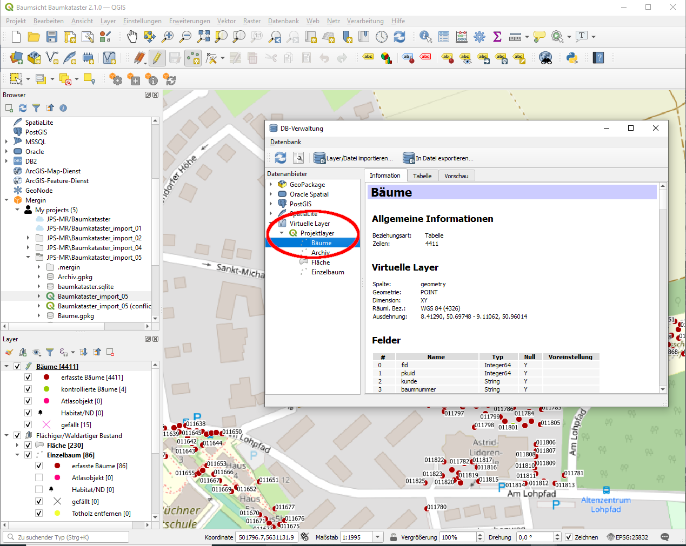
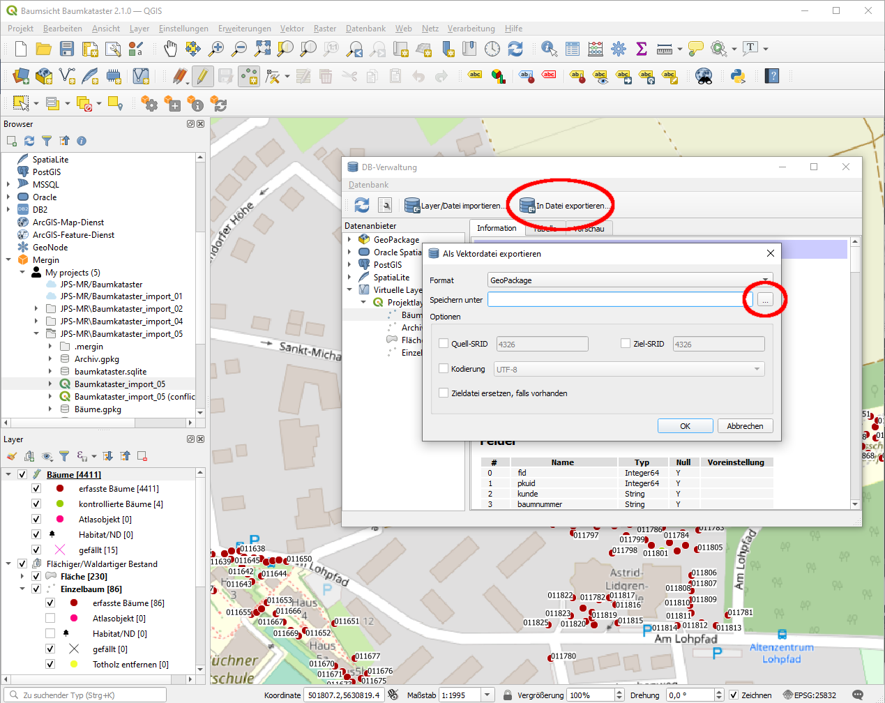
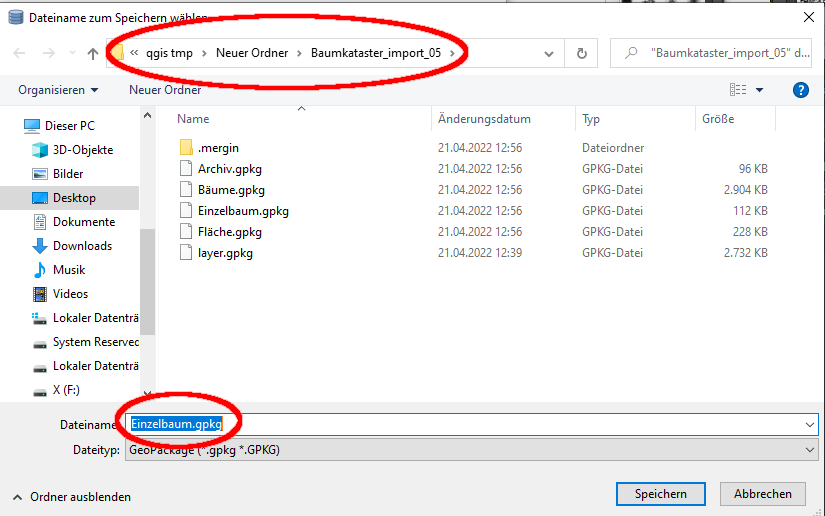
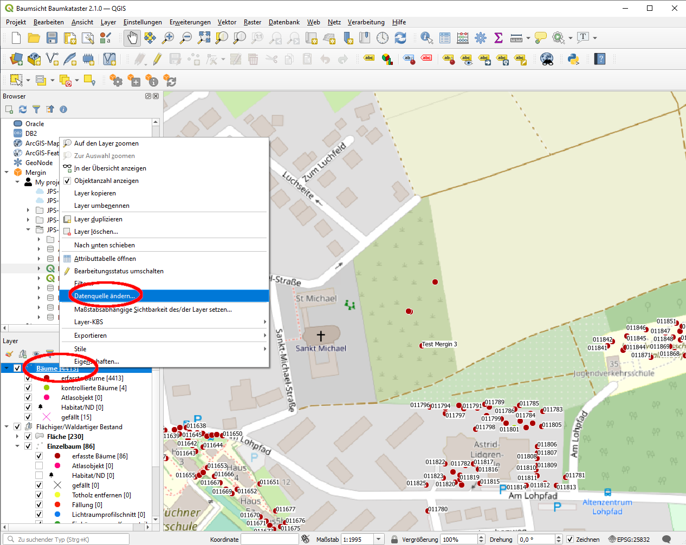
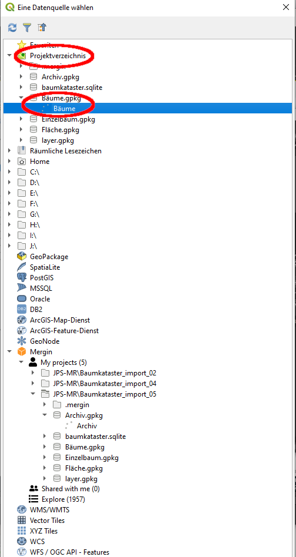
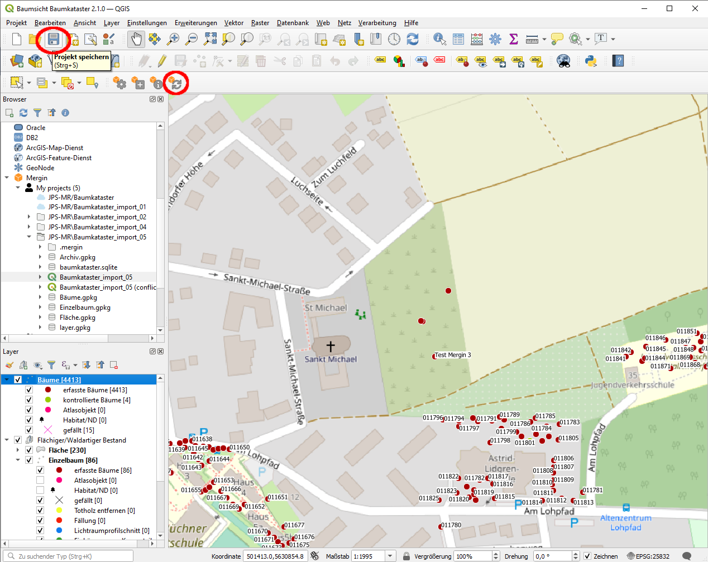
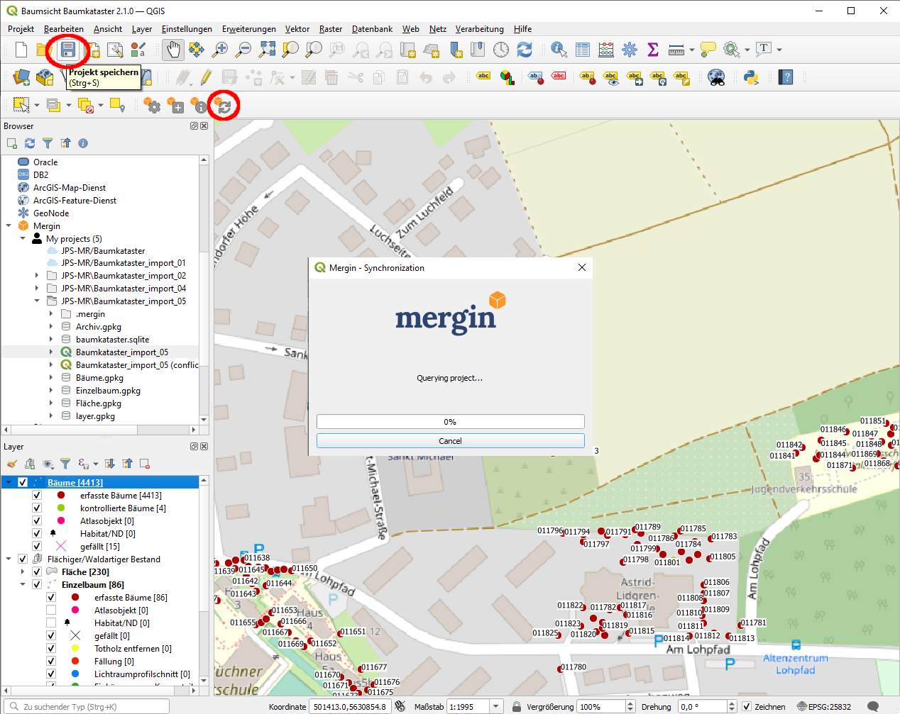
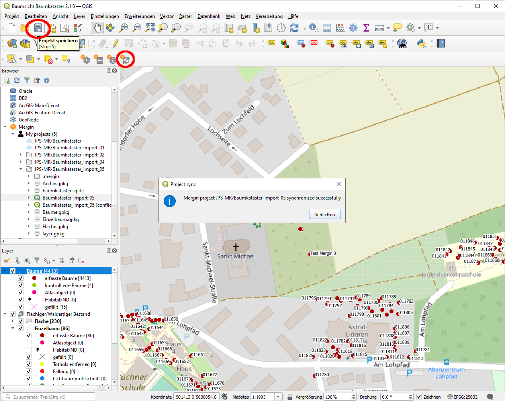

# mergin-documentation  

# Installation Mergin Plugin  

# Anlegen von neuem Mergin-Projekt  

# Aktualisieren der Daten-Layer-Verknüpfungen  

## Speichern der Layer-Daten im Mergin-Projektordner  

0. Lade aktuelles Mergin-Projekt (mit Daten-Layern, die verwendet werden sollen).
1. Wähle unter `Datenbank` `DB-Verwaltung...` 

2. Wähle unter `Virtuelle Layer -> Projektlayer` einen der zu speichernden Layer (hier: `Bäume`)

3. Wähle `In Datei exportieren...` und lege den Speicherort fest...

4. ... navigiere zum Mergin-Projektordner (hier: `Baumkataster_import_05`) und benenne die Datei dem Layer entsprechend (hier: `Bäume`; die Dateiendung `.gpkg` wird automatisch ergänzt).

5. Wiederhole 2.-4. für alle zu exportierenden Layer.
6. Wähle mit Rechtsklick im Projektfenster unter Layer den neu zu verknüpfenden Layer (hier: `Bäume`), dann `Datenquelle ändern...`.

7. Im sich öffnenden Fenster wähle unter `Projektordner` die Datei für den aktuellen Layer (hier: `Bäume.dpkg`) und dort den einzigen Eintrag (der den selben namen hat wie der aktuelle Datenlayer) per Doppelklick.

8. Wiederhole 6.-7. für alle neu zu verknüpfenden Layer.
9. Speichere die aktuellen Änderungen. Synchronisiere anschließend im Mergin-Plugin.

