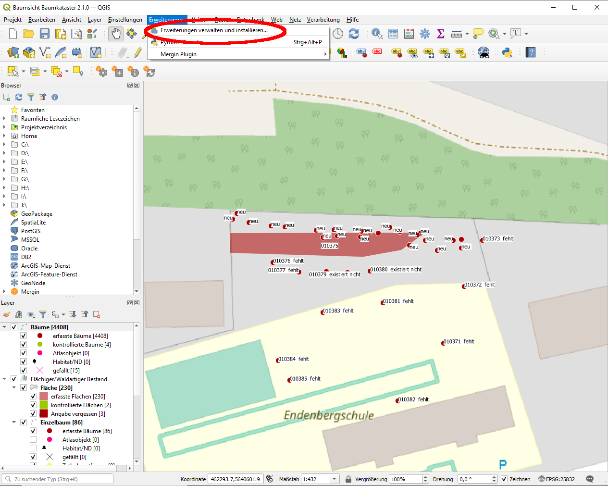
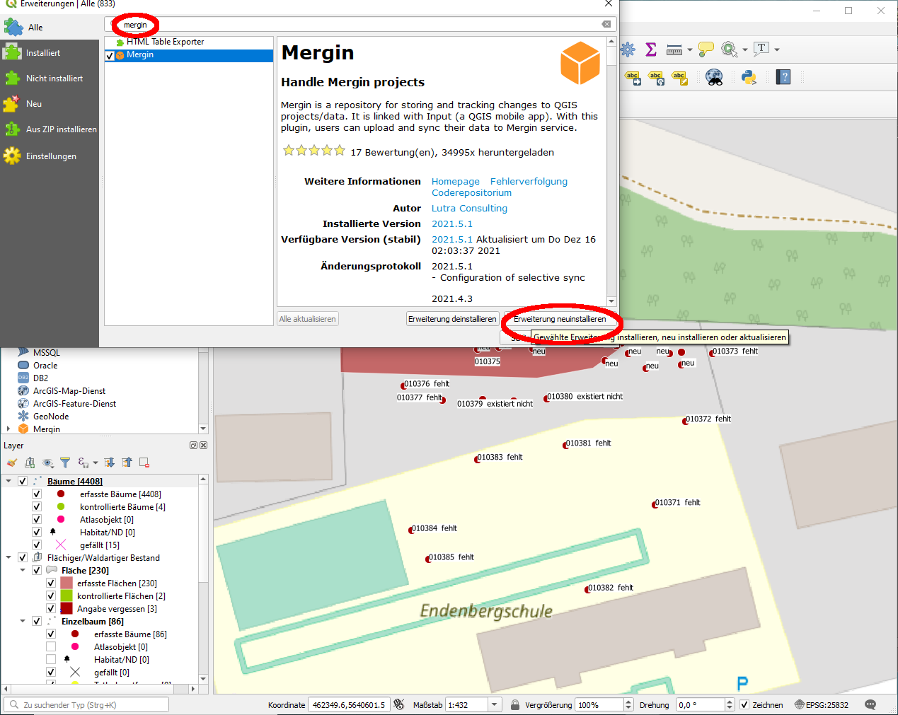

# mergin-documentation  
Mit dem Plugin __Mergin_ kann ein qgis-Projekt online in der Cloud (hier: die offizielle Mergin-Cloud) gespeichert und auf verschiedenen Geräten synchronisiert werden.

# Installation Mergin Plugin  

1. Wähle unter `Erweiterung -> Erweiterungen verwalten und installieren...`.  
  

2. Suche nach _mergin_ und wähle `Erweiterung installieren`.
  

3. Nun stehen die Bedienschaltflächen für das Mergin-Plugin zur Verfügung.
  

4. Über die Konfigurationsschaltfläche (Zahnrad) kann man sich nun mit Nutzername und Passwort bei [mergin](https://public.cloudmergin.com/) anmelden (mit `Test Connection` kann überprüft werden, ob das Passwort korrekt eingegeben wurde). Falls noch kein Account besteht, kann dieser kostenlos angelegt werden.  
  

# Anlegen von neuem Mergin-Projekt  
1. Öffne das Projekt, welches zu Mergin hinzugefügt werden soll.
  

2. Wähle die Layer, welche gespeichert werden sollen. Beachte: In der kostenlosen Version der Mergin-Cloud stehen lediglich 100MB Speicher zur Verfügung. OpenStreetMap (OSM) Karten werden nicht in der Cloud gespeichert, sondern bei Bedarf direkt vom OSM-Server geladen.  
  

3. Lege den Projektnamen fest.  

  

4. Im qgis-Datei-Browser findet sich nun unter `Mergin -> My projects` das so eben erstellte Projekt.
  

5. Per Doppelklick oder über `Open QGIS project` lässt sich das Mergin-Projekt öffnen.    
__Achtung__: Die Datenbank-Verlinkungen der Daten-Layer (hier: `Bäume`, `Fläche`, `Einzelbaum`, `Archiv`) sind weiterhin mit der lokal gespeicherten sqlite-Datenbank verknüpft. __Diese müssen im Folgenden aktualisiert werden, soll das Projekt auch auf anderen Geräten korrekt geladen werden können!__
  

6. Das Projekt ist nun im verlinkten Mergin-Repository in der [Mergin-Cloud](https://public.cloudmergin.com/) (via Webbrowser) verfügbar.  

  

7. Zu Beginn und Ende jeder Arbeitsphase sollte das Projekt synchronisiert werden (nach Änderungen auf vorheriges Speichern achten!). Danach erst stehen die Änderungen in der Mergin-Cloud zur Verfügung.
  

# Aktualisieren der Daten-Layer-Verknüpfungen  

## Speichern der Layer-Daten im Mergin-Projektordner  

0. Lade aktuelles Mergin-Projekt (mit Daten-Layern, die verwendet werden sollen).
1. Wähle unter `Datenbank` `DB-Verwaltung...` 
  

2. Wähle unter `Virtuelle Layer -> Projektlayer` einen der zu speichernden Layer (hier: `Bäume`)
  

3. Wähle `In Datei exportieren...` und lege den Speicherort fest...
  

4. ... navigiere zum Mergin-Projektordner (hier: `Baumkataster_import_05`) und benenne die Datei dem Layer entsprechend (hier: `Bäume`; die Dateiendung `.gpkg` wird automatisch ergänzt).
  

5. Wiederhole 2.-4. für alle zu exportierenden Layer.
6. Wähle mit Rechtsklick im Projektfenster unter Layer den neu zu verknüpfenden Layer (hier: `Bäume`), dann `Datenquelle ändern...`.
  

7. Im sich öffnenden Fenster wähle unter `Projektordner` die Datei für den aktuellen Layer (hier: `Bäume.dpkg`) und dort den einzigen Eintrag (der den selben namen hat wie der aktuelle Datenlayer) per Doppelklick.
  

8. Wiederhole 6.-7. für alle neu zu verknüpfenden Layer.
9. Speichere die aktuellen Änderungen. Synchronisiere anschließend im Mergin-Plugin.

